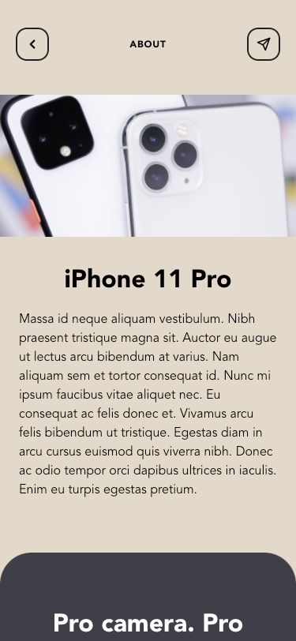
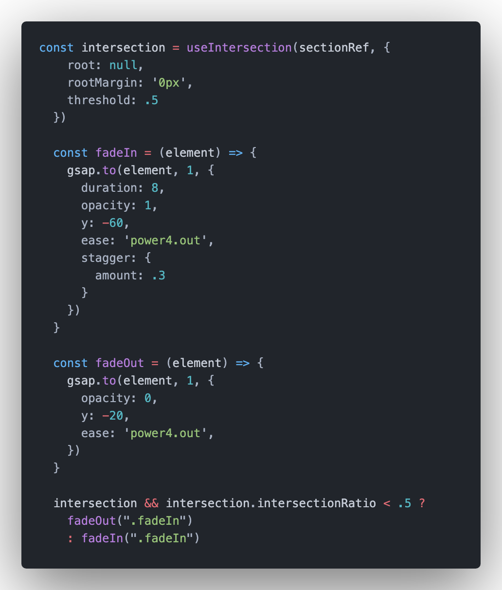

<h1 align="center">
  Project for fun in React.js and Gsap
</h1>

## !important STILL IN PROGRESS

<h2 align="center">
  
</h2>

## Project Specifications

GSAP animations on scroll without using Scroll Magic!

### "useIntersection" react hook from "react-use"

<h2 align="center">
  
</h2>